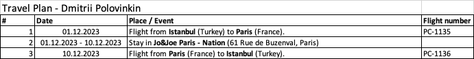

> Важная пометка: гайд по факту о том, как я получал визу в 2023ем году, получил визу на год. 
>
> Статья должна быть актуальной и на 2025 год!

Весной 23его года я в первый раз получал шенген от страны отличной от привычной многим петербуржцам Финляндии, и после изучения текущей ситуации на визовом, так сказать, рынке, пришел к выводу что сейчас возможно чуть ли не единственная страна которая стабильно дает насколько-то длинные мультивизы - это старушка Франция.

Из других стран что еще дают что знаю:
- Испания дает совсем уж короткие визы на месяца 3
- Греция дает чаще просто под поездки, разве что может дать длинные если были до этого длинные визы
- Италия дает больше под поездки
- И только во Франции без визовой там истории можно сразу получить на полгода, а если у вас уже были французские визы, люди получают и на год, два, и даже пять!

Ну и в общем тк я хотел попутешествовать по Европе, пришлось потратить сколько то времени на изучение как вообще обстоит дело с подачей визы туда, что собирать, как подаваться и сколько это все требует времени и денег. 

**Важно - вся это подача делается только из России, в основном из Москвы или Петербурга**, хоть вроде визовые центры есть и в других городах. Но слотов для записей там раздают ощутимо меньше чем в столицах

Весной я при первой подаче получил мультивизу на полгода, а на прошлой неделе с немаленьким удовольствием узнал что получил визу уже на год!  Поэтому хочу поделиться информацией по поводу того, как сейчас это вообще все делается для того, чтобы облегчить людям, кто интересуется сейчас этим весь этот процесс. 

Я подозреваю что есть и другой подход и можно и по другому, там через каких нибудь "помогаторов" или там агентства, но я решил что вообще как то надежнее будет делать это все самому, заодно и разберусь, ведь как не крути до этого я сильно ни на какие визы сам документы не собирал) А за качество работы и сбора доков рандомной компании поручиться не могу.

Попробую просто пройтись по последовательности шагов которые я делал что весной 2023его года, что осенью когда я получал визу и писал эту статью. Буду больше делать упор на инфу и сроки которые у меня были в последний раз именно осенью 2023его года, а не весной, потому время уже прошло, и тогда это кстати все заняло больше времени.

## Запись через бота
Записаться в визовый центр самому сейчас или очень сложно или вообще нереал, все записываются через специальных ботов в телеге, которые автоматизированно записывают вас и высылают за деньги бланк о записи.

Для записи я использовал **Leaf Visa Bot**, нашел его упоминание в Форуме Винского, мне он оба раза очень хорошо помог. Сейчас осенью они даже сделали сайт где можно отслеживать инфу о вашей заявке. В общем и целом, я даже не пользовался никакими форумами с вопросами про бота, потому что там все и так понятно что куда заносить. В основном им нужна основная ваша инфа для подачи просто заявки. Вот их сайт, там и ссылка будет на сам бот - https://www.leafvisa.ru/france

Судя по последней инфе, стоимость записи в Москве это 15к рублей, в Петербурге 9к. Цены меняются, мне например пришлось отслюнявить 15к только для Питера недавно, для Москвы было больше 20ти. Сейчас вот дешевле)

## Сроки
Лично мой опыт сейчас, это что с момента подачи заявки на запись через бота, до того как он вас запишет - это неделя-две, и после инфы про то, что вас записали, сам appointment будет еще недели через две.

Я например подал заявку и оплатил 18ого октября 2023 года. 26ого я получил уведомление что меня записали на 10ое ноября. Спойлер - виза пришла в пункт самовывоза в Петербурге 23его ноября.

**Получается в сумме с момента записи до визы на руках прошло можно сказать месяц и неделя!**

## Список документов
Тут наверное самые сложности, потому что документов надо собирать достаточно немало, но все это облегчается тем, что есть довольно таки кладезь информации на Форуме Винского - если кто не знаком, это главный русский форум по путешествиям. Там можно наверное про все найти информацию)

Главный раздел что там нужен - это [Виза во Францию](https://forum.awd.ru/viewforum.php?f=544)

Там же есть тред с руководством как вообще подаваться и что собирать главное тут - [Как получить визу во Францию ​​без головной боли: Подробный гид для граждан РФ](https://forum.awd.ru/viewtopic.php?f=544&t=340422)

В общем и целом список заключается из следующих пунктов, НО - главное ориентируйтесь на список и инфу на форуме, тут больше как переношу список что у меня с моей записной книжке был и какие то моменты связанные с ними.

- Две типовые цветные фотки вашей мордашки
- Специальная анкета которую надо заполнять на специальном сайте и распечатать. **Важно** - в гайде по документам ссылка устарелая на момент когда я подавал, так что сайт что там нужен сейчас - он [ПО ЭТОЙ ССЫЛКЕ](https://application-form.france-visas.gouv.fr/fv-fo-dde/accueil.xhtml). Пришлось покопаться в форуме ради нее.
Анкету заполнять это не шубу в трусы заправить, поэтому я пользовался руководством по полям из "Гайда без головной боли" на что ссылка выше, в общем то этого хватало. Анкету в консульство надо только одну. А фотки - две.
- Registration receipt - штука которая идет в комплекте с анкетой выше
- Appointment Letter - штука в PDF которую вам кидает бот (за которую вы собственно и платите, так сказать) и без которой вас не впустят в визовый центр)
Там же от бота будет и согласие на обработку персональных данных, заполнить и распечатать
- Копии всех заполненных страниц в русском паспорте
- Загран и копия первой страницы. Если у вас их два - надо тащить оба или делать скан *всего* второго и записку почему второй не приносите.
- Оригинал прошлого заграна. Ну понятно что чем больше было там виз тем лучше
- Страховка по шенгену на срок поездки (или больше) минимум на 35к евро. Я тащил скан моей на 150к идущей в комплекте к моей Райф карточке, а весной делал просто в Тинькове.
- Бронь проживания. Тут нужна именно бронь - но при этом она может быть возвратная и неоплачиваемая, то есть я оба раза когда подавал просто бронил хостел где-то в Париже где плату спишут за 5 чтоли дней до заезда, и до этого можно бесплатно отменять. Так я и делал) Тут главное чтоб было сделано именно на ваше имя что в паспорте.
- Маршрутный лист. В общем и целом, для этой визы вам не надо покупать билеты во Францию, а просто сделать этот лист. Просто найдите какие рейсы летают на дату вашей предполагаемой поездки на Авиасейлс и обратно, ну и напишите инфу про место проживания. Лист надо подписать и поставить дату. По факту это тупо табличка в экселе что у меня выглядела буквально вот так:

{: style="text-align:center"}

*
Базовый как бревно маршрутный лист
*
- Справки о бабосиках. В общем то, чем их больше - тем лучше. Я брал справку с работы с указанием зп - я просто попросил у бухгалтерии типовую справку для визового центра. Если что - все эти справки и другие доки можно тащить на русском и ничего не надо переводить. Так же я делал выписку со счета в Райфе где у меня в основном лежат рубли, и движения средств на грузинских счетах. Вообще как я понял, чем больше подтверждений что вы "состоятельный боярин/боярыня", тем лучше. Но по идее вроде минимум - это какая либо одна. 2НДФЛ вроде тоже можно нести. Про "мокрые печати" я оба раза не парился, просто делал выписки из банков и их печатал в чб.

Ну и все, приходите, подаете, и когда все будет готово - заказываете либо доставку паспорта курьером (включено в стоимость и вроде по всей России) либо самовывозом.

## Общая стоимость и итоги
Ну тут кратко, в общем и целом, визовые сборы и все такое помимо трат на бота съедят еще тысяч 10-15 (там вроде консульский примерно 9к а визового центра 4к чтоли), так что в общем можно прицениваться на район 25-30к рублей на все про все, в зависимости от стоимости бота, что съедает добрую половину всех трат.

**Так что можно прорезюмировать, что сейчас получение французской визы обойдется вам в 25-30к рублей и 1-1.5 месяца ожидания на все про все.**

Кстати заодно, можете изучить статистику получения виз вот в этом треде на Винском - [Статистика получения визы во Францию гр РФ](https://forum.awd.ru/viewtopic.php?f=544&t=420758&sid=23fbc2333b0730d58bda28de73873587), хорошо видно как именно их выдают.

Так что вот! Буду рад если этот гайд кому либо пригодится, ведь путешествовать интересно, а с шенгенской визой еще интереснее :))