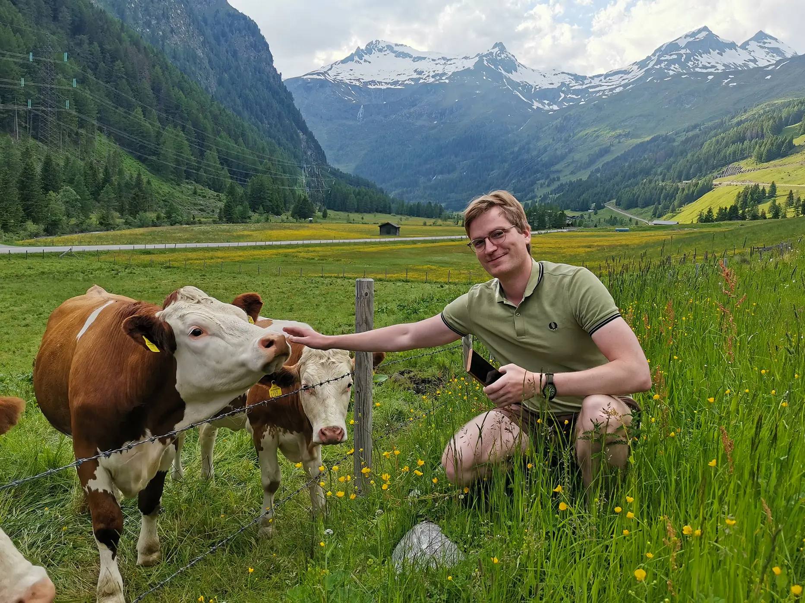

<b>Vagabondity - это сайт с руководствами, которые помогут вам самим все поехать и посмотреть, вместо того, чтобы просто читать о впечатлениях других!</b>

Добро пожаловать на Vagabondity! Меня зовут Дима Половинкин, и я очень рад видеть вас на моем сайте! Я уже несколько лет самостоятельно путешествую по миру с одним рюкзаком (буквально), побывал в <a href="/countries">**больше чем 70ти странах мира**</a>, очень много чего повидал, что попробовал и с кем познакомился - и в процессе набрался разного опыта, которым я хочу с вами поделиться. Я работаю в IT разработчиком в области данных, давно на полной удаленке и вот вовсю исполняю свою давнюю мечту - путешествовать по миру работая удаленно :)

Пока я еще далек от того чтобы утверждать, что исследовал вообще весь мир, но опыт у меня неплохой:
- Я побывал в практически всех странах Европы
- Покатался по настоящему Ближнему Востоку, а не ограничивался Дубаем (хотя там пожил как-то 1.5 месяца)
- Открыл для себя Среднюю Азию где посетил несколько стран
- Довольно неплохо поездил по Юго-Восточной Азии
- Был приблизительно в 50+ городах России. Проехал всю Транссибирскую Магистраль от Владивостока до Москвы

Какое то время я активно веду свой Telegram канал <a href="https://t.me/vagabondingfrog">Vagabonding Frog</a> где рассказываю о своих путешествиях и впечатлениях, но недавно решил, что хочу делиться опытом более детально и в отдельном месте, чем и стал этот сайт.

## Что вы тут найдете?
Это не очередной сайт типичного тревел-блогера. Я считаю что лучше самому/самой поехать и своими глазами видеть разнообразие мира, поэтому тут вы не найдете впечатлений о разных местах, сводок и кучи фотографий, гайдов по определенным локациям.

**Главная цель Vagabondity** - дать вам единую точку получения информации о самих самостоятельных путешествиях - тут вы найдете руководства по различным темам связанных с организацией путешествий, подходу к самостоятельному изучению мира и мышлению как к этому подходить, развернутые советы на определенные темы.  
Я уверен, что здесь вы найдете много полезной информации!

## Кому статьи на сайте могут быть полезны?
- Начинающим путешественникам, которые хотели бы куда нибудь поехать, но переживают, что не знают как это все делается, как все организовать и вообще как это - поехать куда-то в одиночку, особенно в новую страну! Поверьте, все опытные путешественники начинали с чего то, мои статьи помогут вам и дадут нужную вам информацию! :)
- Опытным путешественникам кто уже повидали кучу всего - верю, что вы тоже сможете узнать чего нибудь новенькое!

> Путешествуйте, друзья. Оно того стоит!

Уверен, что мои статьи будут вам полезны!
