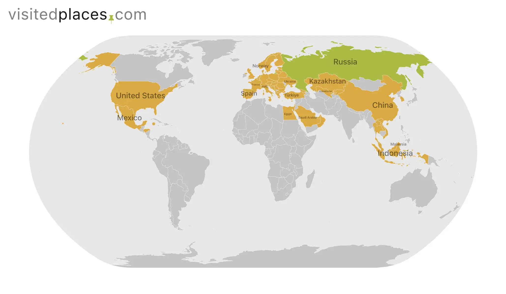

<h3>Список посещенных мною стран мира 
Общее кол-во: 71 страна</h3>

<h3>Европа</h3>

<table class="bold-table">
| 🇷🇺 Абхазия    | 🇦🇱 Албания            | 🏴󠁧󠁢󠁥󠁮󠁧󠁿 Англия     | 🇦🇩 Андорра              |
| 🇦🇹 Австрия    | 🇧🇾 Беларусь           | 🇧🇪 Бельгия    | 🇧🇦 Босния и Герцеговина |
| 🇧🇬 Болгария   | 🇻🇦 Ватикан            | 🇭🇺 Венгрия    | 🇩🇪 Германия             |
| 🇬🇷 Греция     | 🇨🇾 Кипр               | 🇩🇰 Дания      | 🇪🇸 Испания              |
| 🇮🇹 Италия     | 🇱🇻 Латвия             | 🇱🇹 Литва      | 🇱🇮 Лихтенштейн          |
| 🇱🇺 Люксембург | 🇲🇹 Мальта             | 🇳🇱 Нидерланды | 🇳🇴 Норвегия             |
| 🇵🇱 Польша     | 🇵🇹 Португалия         | 🇷🇺 Россия     | 🇷🇴 Румыния              |
| 🇸🇲 Сан-Марино | 🇲🇰 Северная Македония | 🇷🇸 Сербия     | 🇸🇰 Словакия             |
| 🇸🇮 Словения   | 🇺🇦 Украина            | 🇫🇮 Финляндия  | 🇫🇷 Франция              |
| 🇭🇷 Хорватия   | 🇲🇪 Черногория         | 🇨🇿 Чехия      | 🇨🇭 Швейцария            |
| 🇸🇪 Швеция     | 🇪🇪 Эстония            |              |                         |
</table>
---

<h3>Ближний Восток</h3>

| 🇦🇲 Армения   | 🇧🇭 Бахрейн           | 🇬🇪 Грузия | 🇪🇬 Египет |
| 🇮🇱 Израиль   | 🇶🇦 Катар             | 🇦🇪 ОАЭ    | 🇴🇲 Оман   |
| 🇵🇸 Палестина | 🇸🇦 Саудовская Аравия | 🇹🇷 Турция |           |

---

<h3>Америка</h3>

| 🇧🇸 Багамы | 🇭🇳 Гондурас | 🇰🇾 Каймановы острова | 🇲🇽 Мексика |
| 🇺🇸 США    |             |                      |            |

---

<h3>Восточная и Юго-Восточная Азия</h3>

| 🇻🇳 Вьетнам | 🇭🇰 Гонконг     | 🇮🇩 Индонезия | 🇨🇳 Китай    |
| 🇱🇦 Лаос    | 🇲🇴 Макао       | 🇲🇾 Малайзия  | 🇸🇬 Сингапур |
| 🇹🇭 Таиланд | 🇰🇷 Южная Корея |              |             |

---

<h3>Средняя Азия</h3>

| 🇰🇿 Казахстан | 🇰🇬 Киргизия    | 🇺🇿 Узбекистан | |

