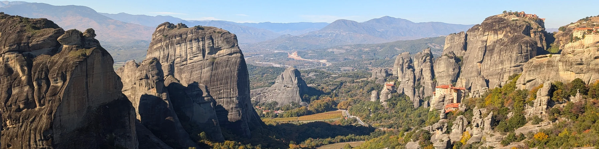

Путешествовать по миру самому без турагенств или помощников очень интересно и намного проще, чем вы думаете! Здесь вы найдете интересные, но не скучные статьи-руководства как это все делается, которые помогут вам разобраться во всем, что важно в самостоятельных путешествиях по нашему интересному и разнообразному миру!

Авторские статьи и сайт - от <a href="https://t.me/polovinkin">Димы Половинкина</a>, путешественника с опытом самостоятельных путешествий по миру и России больше четырех лет и посетившего более 70ти стран мира.

<a href="about">Об Авторе и Сайте</a> - подробнее о цели Vagabondity и об его авторе 
<a href="countries">Посещенные страны</a> - список стран, что я посетил - и сможете и вы!

---

<h2>Статьи и руководства:</h2>

