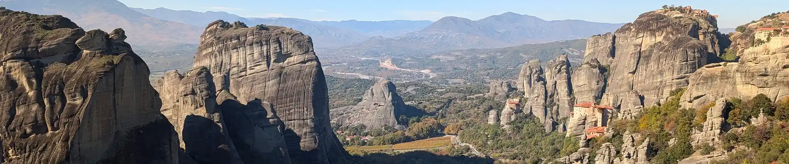

Путешествовать по миру самому без турагенств или помощников очень интересно и намного проще, чем вы думаете! Здесь вы найдете интересные, но не скучные статьи-руководства как это все делается, которые помогут вам разобраться во всем, что важно в самостоятельных путешествиях по нашему интересному и разнообразному миру!

Авторские статьи и сайт - от Димы Половинкина, путешественника посетившего больше 70 стран, с опытом самостоятельных путешествий по миру больше трех лет.

<a href="about">О Проекте</a> - подробнее о цели сайта и авторе 
<a href="countries">Посещенные страны</a> - список стран, что я посетил, и можете и вы!

---

<h2>Статьи и руководства:</h2>

